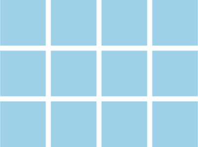
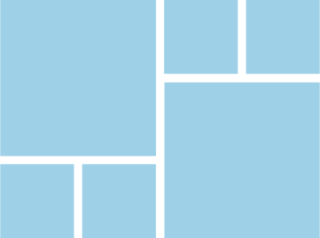
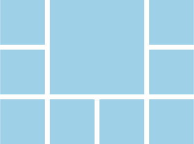

# RequiemAnimation

# Requirements
MUST display a an animated grid of square images
MUST provide different image groups which display separately
MUST toggle through the different images in the group
MUST create visually stimulating animations between images

SHOULD animated smoothly between different groups
SHOULD provide randomized animations

# Definitions

## Groups:
Collections of images with a common color theme. Images are displayed in a grid of squares with a 4x3 grid layout.

## Group Transition
When two groups transition, a new set of images and a new color theme is brought in the replace the old own. In this case, all squares are shifted to make room for the new ones.

## Squares
Come in small, medium, and large. Can either contain an image or a solid color.

## Squares Transitions
They are able to combine, fracture, and shift


# Basic Grid Design
The screen is split into a 4x3 square grid. In each grid space, an image is centered and scaled to fill 90% of the grid space.



An image is also allowed to fill up multiple grid spaces, as long as it maintains it's 1:1 aspect ratio. Three such examples are shown below.







# Animations
The grid regularly and randomly animates in order to cycle through a list of images. The following possible animations are shown below.

## Shift
A randomly selected row or column is pushed out of the frame to make room for a new row or column to slide into place. In the case that the selected row has part of a larger square, all rows containing the larger square are shifted along with the selected row. In this case, additional new rows would need to be generated.

## Combine
Any square group of spaces can be combined into a single space, so long as it does not cut off a larger square. Examples of possible working scenarios in 4x3 space include...
* 4 small squares combine to a medium square
* 9 small squares combine to a large square
* A medium square, and 5 small squares combine to a large square

## Fracture
Any medium or large square can be fractured into smaller parts. This includes...
* A large square into 9 small squares
* A large square into 1 medium square and 5 small squares
* A medium square into 4 small squares

## Color Fade
Prior to combining or fracturing, a square must first fade to a solid color, which is part of the current image-group color theme. After combining or fracturing, the new squares can fade back to images.

A square is allowed to color fade at any time, even when not combining or fracturing.

# Build Instructions
```
npm start
```


## API
```js
//
```
